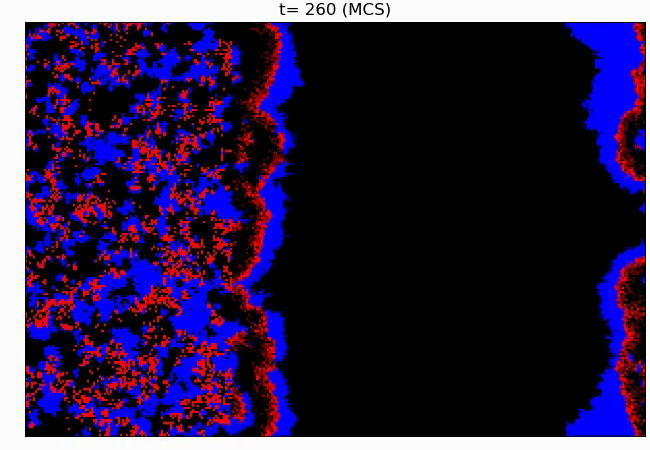

# Stochastic Lattice Simulations
Repository to organize simulation and post-simulation analysis code.

Example of a stochastic lattice simulation: 
*Snapshot of the predators (red) and prey (blue) dynamics at t=260 MCS.*